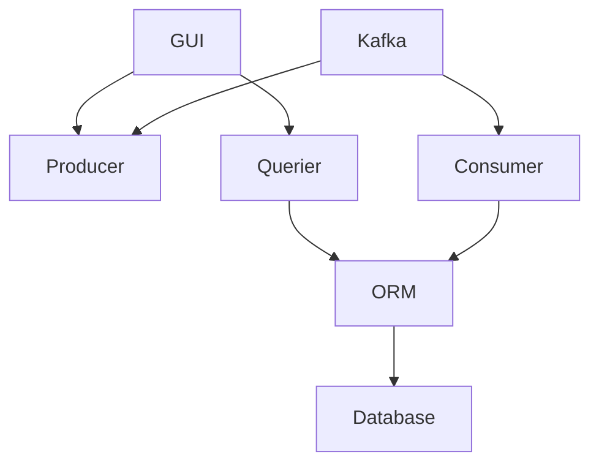

# reservations

## How it all work

## Service Table
| Container | Port | Purpose  |
| :---      | :-   | :- |
| ui        | 8084 | gui |
| cons      | --   | get messages (tasks) from kafka and forwards to orm |
| orm       | 5431 | used as a mitigator for DB |
| prod      | 8080 | receive http request from ui and create messages (tasks) via kafka |
| querier   | 8081 | receive http request from ui and forwards a query via orm |
| discovery | 5555 | receive registrations from all services and used for service discovery | 
| kafka     | 9092, 8082, 8083 | message bus |
| zookeeper | 2181 | ? |
| db        | 5432 | data base |

